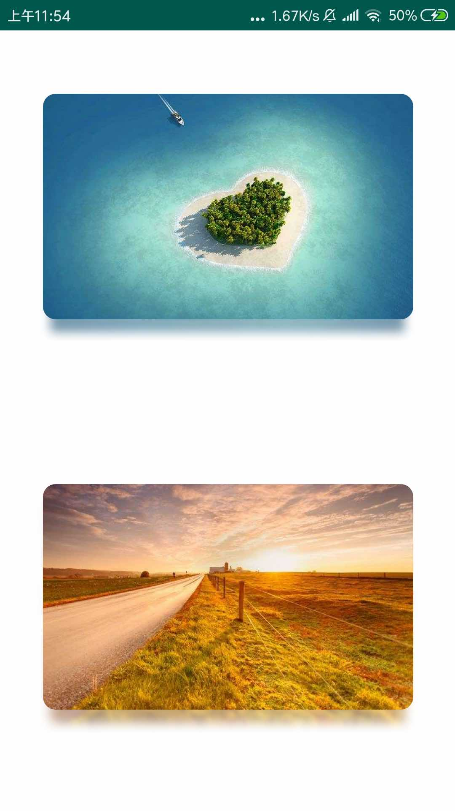

## Android DiffuseShadow ImageView
Android 弥散阴影的ImageView

### 实现思想

##### 其实就是两层ImageView叠加，因为暂不考虑直接绘制的方式，毕竟高斯模糊是很耗资源的，绘制速度很慢，用了一个懒人的做法，就是两层叠加，底层用模糊的图片，顶层用原图，形成弥散阴影图片的效果。

### How to use 如何使用

##### Demo里面有对应的类和xml文件，可以自行修改，就不做成通用了。

      
在layout.xml文件加入，如下:

```
       <com.vita.shadow.DiffuseShadowImageView
            android:id="@+id/iv_image"
            android:layout_width="match_parent"
            android:layout_height="wrap_content"
        />
```


# 效果图
      
   
      
